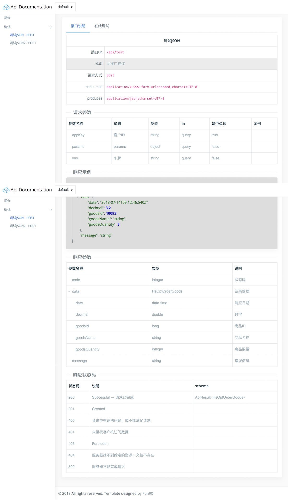

### 使用
1、pom.xml加入依赖
```xml
<dependency>
  <groupId>com.fun90.webjars</groupId>
  <artifactId>swagger-ui-bootstrap4</artifactId>
  <version>1.0.1</version>
</dependency>
```

2、访问地址 http://127.0.0.1:8080/swagger-ui-bootstrap4.html

### 预览


### License
Apache License 2.0